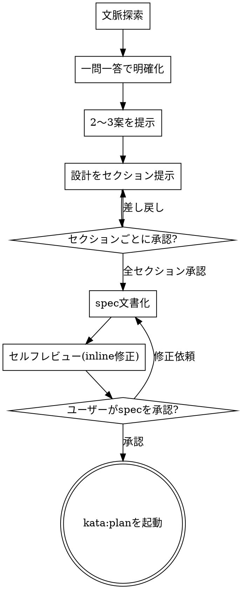

# design（対話でアイデアを設計に育てる）

## 概要

思いつきをそのまま実装に進めない。対話を通じてアイデアを設計へ、そして承認済みの spec 文書へと育てるのがこのスキルの役割である。

流れは次の順に進む。

1. プロジェクト文脈を把握する
2. 一問一答でアイデアを明確にする
3. 2〜3 案を比較して提示する
4. 設計をセクションごとに提示し、都度確認を取る
5. 承認された設計を spec として文書化する

コード 1 行も書く前に、この 5 段階を踏む。

## HARD-GATE

```
設計を提示し、ユーザーが承認するまで、
実装スキルの起動・コードの作成・プロジェクトのスキャフォールドを一切行わない
```

この制約はプロジェクトの見た目の複雑さと無関係にすべてに適用する。「小さな修正だから」「一目で分かる変更だから」という判断は、この掟を外してよい理由にはならない。設計を提示していない段階でコードに触れたことに気づいたら、その場で手を止めて設計提示に戻る。

## アンチパターン: 「単純すぎて設計は要らない」

CLI にフラグを 1 つ足すだけの変更でも、日付を整形するだけの小さな関数でも、CI の設定値を 1 箇所書き換えるだけの作業でも、この工程は同じように通す。

むしろ単純に見える依頼ほど注意が要る。規模が小さいと「分かりきっている」と感じて確認を飛ばしがちだが、飛ばした思い込みが外れたときの手戻りは、大きなプロジェクトの手戻りより比率で見ると高くつく。確認の手間そのものは小さいのに、飛ばして得をする場面はほとんどない。

設計の分量は自由に調整してよい。本当に単純なら数行の説明で十分である。しかし「提示して確認を取る」という工程自体は、分量をゼロにしてよい理由にはならない。

## チェックリスト

TaskCreate ツールが利用可能なら、以下をそれぞれタスクとして登録し順に消化する。利用できない場合は、同じ項目を todo リストとして管理する。

1. プロジェクト文脈を探索する
2. 一問一答でアイデアを明確にする
3. 2〜3 案を提示する
4. 設計をセクションごとに提示する
5. spec を文書化する
6. セルフレビューを行う
7. ユーザーレビューを受ける
8. `kata:plan` へ移行する

## プロセスフロー



**終端は `kata:plan` の起動だけである。** 承認が下りた後、他の実装スキルへ寄り道しない。

## プロセス詳細

### 文脈探索

質問を始める前に、既存のファイル・docs・直近のコミット履歴を見て、何がすでにあり何がないかを把握する。

依頼の中に独立した複数のサブシステムが混ざっている場合（例:「勤怠の打刻と、シフト表の自動生成と、月次の給与集計を一度に作りたい」）、細部を詰める質問に入る前に分解を提案する。独立して動く単位ごとに spec を分けたほうが、後続の plan も execute も扱いやすくなる。1 つの依頼を無理にひとつの設計へ押し込めない。

### 判断を求めるときの作法

ユーザーが判断のために読む必要がある内容は、判断を求めるのと同じ場所に置く。ダイアログの外に出力したテキストが、ユーザーに読まれない環境があるためである。

判断材料が選択肢（label / description / preview）に収まる分量なら、AskUserQuestion で選ばせる。収まらない分量——設計セクションの本文など——を承認してもらう場合は、その本文をそのターンの最後のテキストとして提示し、ターンを終える。承認は次の返信で受ける。長い本文とダイアログを同一ターンに並べない。すでにファイルへ保存したもの（spec など）は、本文を貼らずパスと要旨を提示してターンを終える。

この使い分けは「選択式を優先」の原則より優先する。読まれていない内容への「よい」は、承認ではないからである。

### 質問

1 メッセージにつき質問は 1 つだけ。複数の論点がある場合は、まとめて聞かず 1 つずつ分ける。

AskUserQuestion ツールが利用可能なら、選択肢を提示して選んでもらう形にする。このとき、選ぶために必要な判断材料は選択肢の `description` / `preview` の中に書き切る。構成の比較が要る質問では、選択肢ごとの違いを短く並べた preview を添えてもよい。ツールが利用できない環境では、本文中に選択肢を箇条書きで列挙し、番号や記号で選べるようにする。

質問で固めるのは「何のために作るのか」「譲れない条件は何か」「どうなれば完成と言えるのか」の 3 点であり、実装の細部はここでは掘らない。

### 視覚提示

レイアウト比較やデータの流れなど、図で見せたほうが言葉より速く伝わる場面が出てくる。そのときだけ視覚提示を使う。UI に関する話題というだけで自動的に視覚提示が要るわけではない。「この 2 レイアウトはどちらが良いか」は視覚向き、「この用語はどういう意味か」は文章向き、と区別する。

Artifact ツールが利用可能なら、モックアップや図を HTML で作成して提示する。利用できない環境では、同じ内容を ASCII 図やテキストのボックス・矢印で表現し、言葉だけでは伝わりにくい構造を代替表現する。

```
[クライアント] --request--> [API] --query--> [DB]
                    |
                    +--cache miss--> [キャッシュ層]
```

上のような簡易な図でも、テキストのみの説明より構造が伝わる場面は多い。

### 設計提示

理解が固まったら、設計をセクションに分けて提示する。1 セクションの分量はその複雑さに応じて調整する。単純な部分は数文で済ませ、判断が割れそうな部分だけ厚めに書く。

各セクションを出したら、そこで一度止めて「ここまでで認識が合っているか」を確認する。全部書き終えてからまとめて確認を取る、というやり方はしない。セクションが後から食い違っていると気づいたときの手戻りが大きくなるためである。

ここでの確認は、セクション本文をそのターンの最後のテキストとして出力し、ターンを終える形で行う。承認はユーザーの返信で受ける。セクション本文の直後に AskUserQuestion を置かない。本文が読まれないまま選択だけが行われると、承認ゲートとして機能しなくなる。

最低限カバーする観点:

- アーキテクチャ全体像
- 構成要素とその役割
- データフロー
- エラー処理の方針
- テストの方針

途中で話が噛み合っていないと分かったら、無理に押し切らず質問に戻ってよい。

### 分離と明確さ

設計する各ユニットには、役割を 1 つだけ持たせ、出入り口（インターフェース）を明確にし、単体で検証できる形を目指す。目安として、そのユニットを「〜を受け取って〜を返す部品」という 1 文で言い切れるか試す。1 文に収まらないなら役割を詰め込みすぎている。

もう 1 つの目安は取り替え可能性である。ユニットの中身を丸ごと書き換えたと想像して、呼び出し側のコードを 1 行も変えずに済むか。済まないなら、内部の事情がインターフェースへ漏れており、境界の引き方を見直す必要がある。既存コードに手を入れる設計であれば、まず現状の構造を調べ、そのプロジェクトの流儀に合わせる。目的に関係ない範囲までついでに整理しようとはしない。

## spec 文書化

承認された設計を `docs/kata/specs/YYYY-MM-DD-<topic>-design.md` に書き出し、コミットする。ユーザーが別の保存先を指定した場合はそちらを優先する。

書き終えたら、次の 4 点を 1 回だけ見直し、気づいた点はその場で inline 修正する。往復レビューにはしない。

1. **プレースホルダ走査** — 「TBD」「後で決める」のような未確定表現や、書きかけの節が残っていないか
2. **内部矛盾** — セクション間で言っていることが食い違っていないか。アーキテクチャの記述と各構成要素の説明は整合しているか
3. **スコープ** — 1 本の plan に収まる大きさか。収まらないなら分割を検討する
4. **曖昧さ** — 複数の読み方ができてしまう記述はないか。あれば一方に決めて書き直す

## ユーザーレビューゲート

spec の保存が済んだら、ユーザーに次の形でファイルパスを伝え、目を通してもらう。

> 「spec を `<path>` に保存しました。内容を確認して、plan に進む前に直したい点があれば教えてください。」

ここで返答を待つ。修正依頼が来たら該当箇所を直し、spec 文書化のセルフレビューをもう一度実施する。承認が得られるまで次の工程へは進まない。

## 終端: kata:plan へ

ユーザーの承認が取れたら、必ず `kata:plan` を起動する。承認直後に別の実装スキルへ直接進んだり、コードを書き始めたりしない。

EnterPlanMode を使いたくなる場面（実装計画を立てながら進めたいとき）でも、先にこのスキルを最後まで終わらせてから移る。設計の合意なしに計画だけ先行させると、後になって前提から崩れる。

## 主要原則

- **一問一答** — 質問は 1 メッセージに 1 つ
- **選択式を優先** — 答えやすさを優先し、可能なら選択肢を用意する。ただし判断材料が選択肢に収まる場合に限る
- **読ませてから訊く** — 分量のある本文を承認してもらうときは、本文でターンを終えて返信を待つ。本文とダイアログを同一ターンに並べない
- **YAGNI** — 今要らない機能は設計にも入れない
- **必ず複数案** — 1 案だけを提示して終わらせない。トレードオフ込みで比較する
- **逐次承認** — セクションごと・spec 全体ごとに確認を取ってから次に進む

## 関連スキル

- 承認された spec をもとにした実装計画の作成は `kata:plan` に引き継ぐ。
