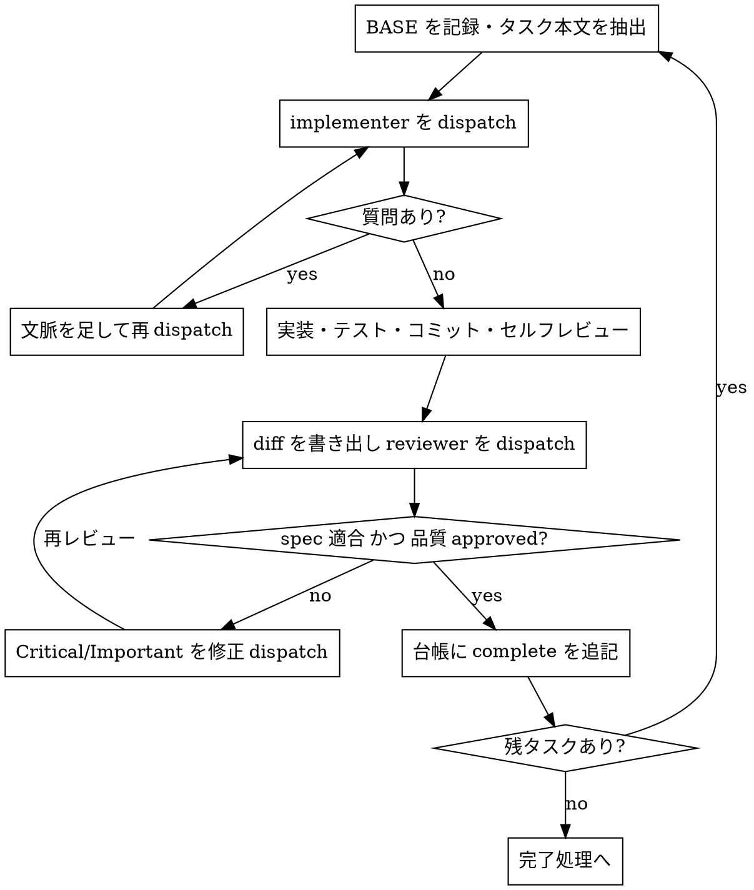

# execute（プランを隔離環境で実行する）

## 概要

execute は、書かれたプランを読み、批判的にレビューし、隔離された作業環境で全タスクを実行しきるスキルである。まず Step 0 で作業環境を分離し、次にプランを読み込んで `Depends on` から wave を導出し、実行モード（自走 / サブエージェント駆動〔直列 / wave 並列〕）を選んで宣言し、タスクループを回す。

原則として、main/master 上で直接実装を始めない。ユーザーの明示的な同意がある場合を除き、隔離された作業環境を用意してから着手する。

## Step 0: 作業環境の分離

**既存の分離を検出する**（何かを作る前に必ず）:

```bash
GIT_DIR=$(cd "$(git rev-parse --git-dir)" && pwd -P)
GIT_COMMON=$(cd "$(git rev-parse --git-common-dir)" && pwd -P)
git rev-parse --show-superproject-working-tree 2>/dev/null  # 値が返ればサブモジュール
```

`GIT_DIR` と `GIT_COMMON` が異なり、かつサブモジュールでなければ、既に linked worktree の中にいる。新たに作らず「セットアップとベースライン」へ進む。両者が一致する（またはサブモジュール）なら通常の checkout であり、ユーザーが worktree を希望しているかを確認してから作る（既に指示があればそれに従う）。サブモジュールでも `GIT_DIR != GIT_COMMON` になるため、このガードを省くと worktree と誤判定する。

**分離を作る**:

- EnterWorktree ツールが利用可能なら必ずそれを使う。ネイティブツールがあるのに `git worktree add` を叩くと、ハーネスが把握・管理できない phantom state を生む典型的な失敗になる。
- なければ `git worktree add` にフォールバックする。配置先は既定で `.worktrees/<branch>`。**作成前に `git check-ignore` で ignore 済みかを必ず確認**し、未 ignore なら `.gitignore` に追加してコミットしてから作る（worktree の中身がリポジトリに混入するのを防ぐ）。

```bash
# ディレクトリ限定パターン（.worktrees/）は対象 dir が未存在だとマッチしないため、子パスで判定する
git check-ignore -q .worktrees/probe || { printf '.worktrees/\n' >> .gitignore; git add .gitignore; git commit -m "chore: worktree ディレクトリを ignore する"; }
FEATURE_BRANCH=<これから作る新しいブランチ名>  # 既存ブランチと重複しない名前にする
git worktree add ".worktrees/$FEATURE_BRANCH" -b "$FEATURE_BRANCH"
cd ".worktrees/$FEATURE_BRANCH"
```

`git worktree add` がサンドボックスの権限拒否で失敗したら、その旨をユーザーに伝え、現ディレクトリで作業を続ける。

**セットアップとベースライン**: 依存をインストールし（`package.json` / `Cargo.toml` / `pyproject.toml` / `go.mod` などを検出して該当コマンドを実行）、その所要時間を控える（Step 2 の wave 並列判断の材料になる）。続けてテストを実行してクリーンな出発点を確認する。ここで失敗する場合、新規バグと既存バグを切り分けられなくなるため、勝手に進めず報告して指示を仰ぐ。

## Step 1: プランを読み込む

プランファイルを読み、批判的にレビューする。疑問・懸念（タスク間の矛盾、プランが要求するのにレビュー基準では欠陥扱いになる指示など）があれば、実行を始める前に一度だけまとめてユーザーに確認する。タスクの途中で気づくたびに割り込むのではなく、着手前に洗い出して 1 回で問う。懸念がなければそのまま進む。

プランの Global Constraints を書き留める。各タスクの要件には、明記がなくてもこの節が常に含まれる。TaskCreate ツールが利用可能ならタスクを登録し、なければ todo リストで代替する。

プランの形式を判別する。タスクに「受け入れ基準」欄があれば**受け入れ基準型**、コード付きステップがあれば**コードステップ型**（従来形式）であり、自走モードの進め方と wave 条件の「実質タスク」判定がこの区別を参照する。コードステップ型は従来どおり記述どおりに実行する（後方互換）。この判別は、`Depends on` の記載有無による旧形式判定（次段落）とは独立した軸であり、組み合わせはすべて有効である。1 つのプラン内での形式混在、および受け入れ基準型プランへの実装本体・テスト本体のコードブロック混入は、プランの欠陥として前段の「一度だけまとめて確認」に含める。

プランの `Depends on` から wave を導出する。タスクの深さを「依存なしは 1、それ以外は 1 + 依存先の深さの最大値」と定め、同じ深さのタスク集合を 1 つの wave とする（チェーン宣言「全タスクは直前タスクに依存する（チェーン）」のプランは、この規則で自然に全直列になる）。チェーン宣言もなく `Depends on` の記載もプラン全体で 0 件のものは旧形式であり、「記載なし = 直前タスク依存」とみなして全直列で扱い、Step 2 のモード宣言で 1 行通知する。循環依存・未定義タスクへの参照・「Consumes が Depends on の推移閉包の外の Produces を使う」・「一部のタスクにだけ記載がない」を見つけたら、プランの欠陥として前段の「一度だけまとめて確認」に含める。

## Step 2: 実行モードを決めて宣言する

ユーザーが会話の中で実行方式を既に指定している場合（`kata:plan` からの引き継ぎ時の指定を含む）は、それに従う。以降の判断・質問は行わない。ただしユーザー指定が上書きできるのは性能判断——モード選択と並列数キャップ値——に限る。次の 4 つは invariant であり、指定では上書きされない: 書き込み作業の worktree 分離、レビュー合格前のマージ禁止、`Depends on` にない独立性の仮定禁止、DAG 妥当性検査。

指定がなければ、次の基準でモードを自分で判断する。

- **自走モード**: タスクが互いに密結合、またはプランが小規模で、サブエージェントを挟むほどでない単純な作業のとき。
- **サブエージェント駆動（直列・推奨）**: タスクが概ね独立していて、自分のコンテキストを新鮮に保ちながら進めたいとき。各タスクを新しいサブエージェントに委ね、自分はコントローラー（調整役）に徹する。会話履歴を継承させず、タスクごとに必要な情報だけを組み立てて渡すことで、サブエージェントは焦点を保ち、自分の文脈も調整作業のために温存できる。
- **サブエージェント駆動（wave 並列）**: 直列の条件に加えて、次の 3 つをすべて満たす wave があるとき。満たす wave だけを「wave 並列実行」の手順で回し、満たさない wave は直列で流す。(1) 同一 wave に実質タスク——実装判断を伴うタスク。受け入れ基準型ではコードを書くタスク（受け入れ基準にテストで検証する挙動を含むタスク）、コードステップ型では本文の転記で済まないタスク——が 2 つ以上ある。(2) セットアップコスト（Step 0 の実測 × worktree 数）が、並列化で節約できる見込み時間に対して明確に小さい。同程度・判断できないときは直列に倒す（グローバルキャッシュが効く cargo / go / pnpm は 2 回目以降のセットアップが軽く、npm は重い傾向がある）。(3) wave 内のタスクが lockfile・migration・barrel といったハブを触らない（plan のハブ集約ルールが守られていれば自然に満たされる。ここは最終ガードである）。

wave 並列で同時に dispatch する数は最大 3 とし、超える分はタスク番号順にキャップずつのサブバッチに切って処理する。ユーザーがキャップ値を明示した場合はそれに従う（4 以上はコントローラーの多重管理が劣化するリスクを 1 行添えて宣言する）。

判断できたら、タスクループに入る前に、選んだモードと根拠を 1〜2 文でユーザーに宣言する。返答は待たず、そのまま実行に進む。

> 「実行モード: サブエージェント駆動（wave 並列）で進めます。wave 2 に独立した実質タスクが 3 つあり、セットアップ実測 40 秒 × 3 に対して並列化の節約見込みが十分大きいためです。同時 dispatch は最大 3 です。」

旧形式プラン（`Depends on` 記載なし）の宣言例:

> 「実行モード: サブエージェント駆動（直列）。このプランには Depends on の記載がないため全タスクを直列で実行する。並列実行したい場合は kata:plan で依存関係を明示してから渡すこと。」

宣言なしでタスクループに入ってはならない。宣言は、ユーザーがモード選択に異論を挟める最後の機会である。

両方の基準に同程度当てはまる、プランからタスクの独立性が読み取れない、など基準で決めきれない場合のみ、ユーザーに質問して回答を待つ。AskUserQuestion ツールが利用可能なら選択式で提示し、判断材料（各モードをこのプランに適用したときの違い）は選択肢の description に埋め込む。ツールがなければ本文で番号選択にする。

## 自走モード

タスクごとに順に:

1. 対象タスクを in_progress にする。
2. 受け入れ基準型では、受け入れ基準を `kata:tdd` で 1 挙動ずつ消化する。コードステップ型では、ステップをプランの記述どおりに実行する。契約や記述から逸脱したくなったら、その場で進めず停止して確認する。
3. プランが指定する検証コマンドを実行する。
4. completed にする。

コードを書くタスクでは `kata:tdd` に従う。ブロッカー（依存の欠落、テスト失敗、指示の不明瞭さ、検証の繰り返し失敗）に当たったら、推測で突破せず停止して質問する。全タスク完了後は「完了処理」へ進む。

## サブエージェント駆動モード（直列）

**原則**: タスクごとに新しい implementer サブエージェントを起動し、タスクごとにレビューを挟み、最後にブランチ全体をレビューする。タスクとタスクのあいだでユーザーに「続けていいですか？」と尋ねない。手が止まってよい場面は限られている——自力で解消できない BLOCKED に突き当たったとき、曖昧さのせいで次の一歩が本当に決められないとき、そして全タスクを終えたとき。それ以外での進捗要約や確認プロンプトはユーザーの時間を奪うだけである。**同一 worktree 上で実装サブエージェントを並列に起動してはならない**（同じブランチを触ってコンフリクトする）。並列実行は、worktree 分離と wave 単位の統合検証を備えた「wave 並列実行」の手順による場合に限る。



**dispatch 手順**:

1. タスクに着手する前に、現在の HEAD を BASE コミットとして控える（`git rev-parse HEAD`）。1 タスクが複数コミットにまたがっても差分を取りこぼさないため、後のレビューでは `HEAD~1` でなくこの BASE を使う。
2. 該当タスクの本文だけをプランから一意な名前のファイルへ切り出す。プラン全文をサブエージェントに読ませない。ヘルパースクリプトは使わず、該当タスクの範囲を手でコピーする。
3. Agent ツール（`general-purpose`）で `references/implementer-prompt.md` のプレースホルダを埋めて起動する。dispatch に入れるのは、タスクの位置づけ 1 行・タスク本文ファイルのパス・先行タスクが公開したインターフェース・報告書ファイルのパスと報告契約だけ。会話履歴や前タスクの要約を貼らない。

**モデル選択**: dispatch のたびにモデルを明示する。省略すると最も高価なセッションモデルを継承してしまう。単一ファイルの機械的修正（typo・設定値・ドキュメント）とコードステップ型プランの転記的タスクは安価なモデル、コードを書くタスク（実装判断を伴う）と複数ファイルの統合はセッション標準、最終ブランチレビューは最も能力の高いモデルを使う。

実装者の報告を受けたら、レビューに入る前にメインリポジトリの `git status` がクリーンであることも確認する（`git -C "$(git rev-parse --git-common-dir)/.." status --short`。作業環境の外への編集漏れの検出）。漏れを見つけたら勝手に破棄せず、内容を調べてユーザーに報告する。

**実装者ステータスの処理**（4 種）:

- **DONE**: タスクレビューへ進む。
- **DONE_WITH_CONCERNS**: 完了はしたが疑義あり。懸念を読み、正しさ・スコープに関わるならレビュー前に解消する。単なる観察（「このファイルが大きくなってきた」など）なら記録してレビューへ進む。
- **NEEDS_CONTEXT**: 必要な情報が渡っていない。不足を補って再 dispatch する。SendMessage が利用可能なら同一エージェントを継続、なければ文脈を足して新規に dispatch する。
- **BLOCKED**: 完了不能。原因を見極める——文脈不足なら補って同じモデルで再 dispatch、推論力不足ならより能力の高いモデルへ、タスクが過大なら分割、プラン自体の誤りならユーザーへエスカレーション。同じ条件のまま同じモデルに再試行させない。

**タスクレビュー**:

```bash
HEAD=$(git rev-parse --short HEAD)
mkdir -p .kata
git diff -U10 "$BASE".."$HEAD" > .kata/review-"$BASE"-"$HEAD".diff
```

差分を一意な名前のファイルへ書き出し、`references/task-reviewer-prompt.md` を埋めてレビュアーを dispatch する。レビュアーには二重判定——spec 適合とコード品質——を求め、spec 適合 ✅ かつ品質 approved が揃うまでタスクを完了扱いにしない。

- Critical / Important の指摘は修正サブエージェントを dispatch し、再レビューにかける。修正 dispatch にも実装者と同じ契約を課す（変更を覆うテストを再実行し、コマンドと出力を報告させる）。
- Minor は台帳に記録し、最終ブランチレビューへ回す。
- レビュアーが「⚠️ Cannot verify from diff」として挙げた項目は、プランと横断的文脈を持つ自分が各件を解消する。実在するギャップと判断したら、spec 不適合として実装者に差し戻して再レビューする。
- プランが明示的に指示している事項をレビュアーが欠陥と指摘した場合は、どちらが優先かをユーザーに判断させる。プランを盾に指摘を握り潰さず、プランに反する修正を無断で dispatch しない。

**進捗台帳**: コンパクションで会話メモリは失われる。現在地を見失ったコントローラーが、済んだはずのタスク列を頭から dispatch し直せば、それまでの成果と同じだけのコストをもう一度払うことになる。この事故を防ぐため、リポジトリルートの `.kata/progress.md`（git-ignore された作業ファイル。未 ignore なら `.gitignore` に追加してコミットする）に進捗を残す。

- スキル開始時に台帳を確認する。complete / merged と記録済みのタスクには着手しない。再開は「各タスクの最新行が現在状態」で判断するが、台帳を鵜呑みにせず、`git worktree list --porcelain`・各タスクブランチの実在と HEAD・worktree のクリーン状態・統合ブランチへのマージ済みか否かを突き合わせてから続行・再 dispatch する。
- タスクのレビューがクリーンになったら、他の記録と同じメッセージで `Task N: complete (commits <base7>..<head7>, review clean)` を 1 行追記する。
- 再開・コンパクション後の現在地確認は、うろ覚えの会話内容ではなく台帳と `git log` に基づいて行う。台帳に書かれたコミットは、こちらが覚えていなくても git 上に残っている。
- wave 並列では次のイベント行を使う（直列実行分は従来の complete 行のまま）。台帳を書くのはコントローラーだけであり、場所は統合 worktree の `.kata/progress.md`（タスク worktree 内には作らない）。

```
Wave 2 start: tasks 3,4,5 (branches feature-x-task-3, feature-x-task-4, feature-x-task-5)
Task 3: dispatched (worktree .worktrees/feature-x-task-3, base a1b2c3d)
Task 3: review clean (commits a1b2c3d..4e5f6a7)
Task 3: merged (merge 8b9c0d1)
Wave 2 complete (integration verify: green)
Wave 2 partial (task 4 blocked: <理由>)
```

## wave 並列実行

サブエージェント駆動の並列形である。dispatch 手順・実装者ステータス 4 種の処理・タスクレビュー・修正 dispatch の契約は「サブエージェント駆動モード（直列）」の記述をそのまま適用し、本節には wave 固有の差分だけを書く。

並列 dispatch の共有原則は次の 3 つで、`kata:parallel`（プランなしの独立ジョブ束の入口）もこの原則を参照する。

1. **自己完結プロンプト** — 会話履歴に依存させず、タスクの判断に必要な情報だけを構成して渡す（実例は `kata:parallel` の「良いプロンプトの条件」を参照）
2. **書き込み作業の worktree 分離必須** — 同一作業ツリーへの並列書き込みは禁止する
3. **統合時検証** — エージェントの報告を信用せず、自分で diff と検証コマンドの結果を確認する

タスク worktree の作成には `git worktree add` を明示的に使う。これは Red Flags の「EnterWorktree があるのに `git worktree add` を使う」の明示的な例外である——EnterWorktree はセッションの作業場所を移すツールであり、複数 worktree の並列作成には使えない。

wave ループ（1 サブバッチ分。ステップ 1 は wave の最初のサブバッチでのみ行う）:

1. 台帳に wave 開始行を追記する（wave の全タスクとブランチ名。dispatch 前に書く）
2. BASE として統合ブランチの現 HEAD を控え、タスクごとに worktree とタスクブランチを作る。`.worktreeinclude` がリポジトリにあれば、列挙された gitignore 済みファイル（`.env` など）を統合 worktree から各タスク worktree へコピーする（手動の `git worktree add` には自動適用されないため）。再実行で同名のブランチ・worktree が既にある場合は台帳と照合し、整合すれば再利用、不整合なら remove して作り直す

```bash
# ディレクトリ限定パターン（.worktrees/）は対象 dir が未存在だとマッチしないため、子パスで判定する
git check-ignore -q .worktrees/probe || { printf '.worktrees/\n' >> .gitignore; git add .gitignore; git commit -m "chore: worktree ディレクトリを ignore する"; }
BASE=$(git rev-parse HEAD)
TASK_BRANCH=<統合ブランチ名>-task-<N>
git worktree add ".worktrees/$(echo "$TASK_BRANCH" | tr '/' '-')" -b "$TASK_BRANCH"
```

3. 各 worktree で依存セットアップを実行する（コントローラーが行う。implementer に任せない）。完了後に `git status --porcelain` がクリーンであることを確認する。lockfile などが動いていたらベースライン不整合なので、勝手に進めず報告して指示を仰ぐ
4. implementer を同一メッセージで並列 dispatch し、台帳に dispatched 行を追記する。dispatch は既存の手順どおりで、次の 2 点だけを変える。プロンプト冒頭に「最初のアクションとして `cd <worktree の絶対パス>` を実行し、`git rev-parse --show-toplevel` で位置を確認してから着手する。ファイル操作は worktree 配下の絶対パスで行う」を含める。`{TASK_CONTEXT}` に「wave 並列実行中。テストはタスク限定まで（フルスイートは統合後にコントローラーが実行する）」を明記する
5. 実装者の報告を受けたら、レビューに入る前に機械的ガードを 2 つ確認する: `git log BASE..<タスクブランチ>` が非空（コミットがタスクブランチに載っている）、統合 worktree の `git status` がクリーン（誤った場所で作業していない）。どちらかが破れていたら誤作業として再 dispatch する
6. ガードを通過したタスクから順に、統合 worktree で `git diff -U10 BASE..<タスクブランチ>` を一意な名前のファイルへ書き出し、reviewer を dispatch する。修正往復もそのタスクの worktree・ブランチ上で行う。合格したら台帳に review clean 行を追記する
7. サブバッチの全タスクが合格したら、タスク番号順に統合ブランチへマージし、台帳に merged 行を追記する。次のサブバッチがあれば、マージ後の HEAD を新しい BASE としてステップ 2 から繰り返す
8. wave の全サブバッチが終わったら、統合検証（フルスイート）を 1 回実行する。green なら `git worktree remove` でタスク worktree を片付け（ブランチは保持する）、台帳に wave 完了行を追記して次の wave へ進む

worktree の作成がサンドボックスの権限拒否などで失敗したら、そのサブバッチで作成済みのタスク worktree を remove してから、wave 並列を諦めてその旨をユーザーに伝え、サブエージェント駆動（直列）にフォールバックする（Step 0 の失敗時と同じ作法）。

**wave のエラー処理**:

- **マージコンフリクト** — その場で解決しない。`git merge --abort` で統合ブランチを正常な状態へ戻してから、plan のファイル重なり見落とし（欠陥）としてユーザーへエスカレーションし、台帳に記録する
- **統合検証 red** — タスク限定テストは各 worktree で合格済みなので、帰属は 2 段で切り分ける。(1) マージ履歴は番号順で線形なので、失敗テストが最初に落ちるマージコミットを順に（または `git bisect` で）特定する。(2) 特定したタスク T のタスクブランチ単体で同じテストを実行する。そこでも落ちるなら T 単独の欠陥（タスク限定テストの範囲外を壊した）として T へ修正 dispatch する。ブランチ単体では通る・テストが存在しないなら、タスク間の相互作用 = 独立性の反例なので、plan の欠陥としてエスカレーションする
- **解消不能な失敗タスク** — BLOCKED の一次対応（文脈補強・モデル変更・分割）で解消しないタスクが wave に残ったら、合格済みタスクは番号順マージ → 統合検証まで進めて確定し、台帳に partial 行を記録する。失敗タスクの worktree とブランチは保持したまま（合格分の worktree は remove してよい）ユーザーへエスカレーションし、次の wave へは進まない。解消後にレビュー → マージ → 統合検証で wave を閉じる

## 完了処理

全タスクが終わったら:

1. **ブランチ全体の最終レビュー**: `kata:request-review` の手順で、ブランチの起点（`git merge-base HEAD main 2>/dev/null || git merge-base HEAD master`）から HEAD までの差分を 1 ファイルに書き出し、最も能力の高いモデルでレビュアーを dispatch する。台帳に溜めた Minor 群もこのレビューに渡し、マージ前に直すものを仕分けさせる。最終レビューが指摘を返したら、修正サブエージェントは 1 つにまとめて全指摘を渡す（指摘ごとに別々のフィクサーを立てない）。
2. **完了主張の検証**: `kata:verify-done` で、テストが実際に通っている証跡を確認してから完了を主張する。
3. **後片付け**: wave 並列で作った統合済みタスクブランチを削除する（マージ済みなので `git branch -d` で消える。worktree は wave 完了時に remove 済み）。
4. **仕上げ**: `kata:finish` を起動し、マージ・PR・クリーンアップの選択を進める。

## Red Flags

やってはいけないこと:

- main/master 上でユーザーの同意なく実装を始める
- 実行モードを宣言せずにタスクループへ入る
- タスクレビューを省略する / spec 判定・品質判定のどちらかを欠いた報告で完了にする
- Critical / Important を未修正のまま次のタスクへ進む
- worktree 分離と wave 単位の統合検証なしで実装サブエージェントを並列起動する（同一 worktree 上での並列起動は常に禁止）
- プランの `Depends on` にない独立性を推定して並列化する（事実は plan、判断は execute）
- レビュー未合格のタスクブランチを統合ブランチへマージする
- マージコンフリクトをその場で解決して先へ進む
- プラン全文をサブエージェントに読ませる（タスク本文だけを渡す）
- 台帳が complete / merged と記録済みのタスクを再 dispatch する
- ブロッカーを推測で強行突破する
- 作業環境の分離（Step 0）で、ネイティブの EnterWorktree があるのに `git worktree add` を使う（wave のタスク worktree 一括作成は明示的な例外。「wave 並列実行」節参照）
- レビュアーに「これは指摘するな」と伝える / severity を先回りして格付けする

## 関連スキル

- 入力となるプランは `kata:plan` が作る。
- 各タスクのレビューと最終ブランチレビューは `kata:request-review` に委ねる。
- コードを書くタスクではサブエージェントに `kata:tdd` を守らせる。
- 完了主張の検証は `kata:verify-done`、ブランチの仕上げは `kata:finish` へ引き継ぐ。
