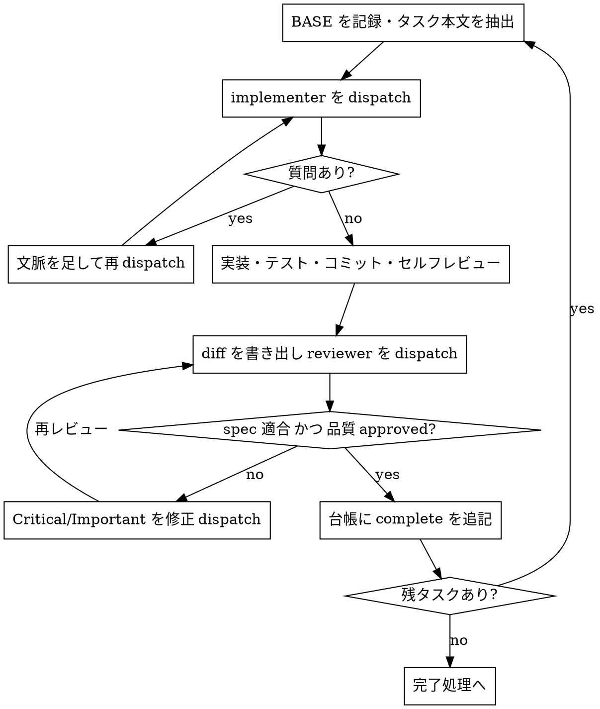

# execute（プランを隔離環境で実行する）

## 概要

execute は、書かれたプランを読み、批判的にレビューし、隔離された作業環境で全タスクを実行しきるスキルである。まず Step 0 で作業環境を分離し、次にプランを読み込み、実行モード（自走 / サブエージェント駆動）を選んでタスクループを回す。

原則として、main/master 上で直接実装を始めない。ユーザーの明示的な同意がある場合を除き、隔離された作業環境を用意してから着手する。

## Step 0: 作業環境の分離

**既存の分離を検出する**（何かを作る前に必ず）:

```bash
GIT_DIR=$(cd "$(git rev-parse --git-dir)" && pwd -P)
GIT_COMMON=$(cd "$(git rev-parse --git-common-dir)" && pwd -P)
git rev-parse --show-superproject-working-tree 2>/dev/null  # 値が返ればサブモジュール
```

`GIT_DIR` と `GIT_COMMON` が異なり、かつサブモジュールでなければ、既に linked worktree の中にいる。新たに作らず「セットアップとベースライン」へ進む。両者が一致する（またはサブモジュール）なら通常の checkout であり、ユーザーが worktree を希望しているかを確認してから作る（既に指示があればそれに従う）。サブモジュールでも `GIT_DIR != GIT_COMMON` になるため、このガードを省くと worktree と誤判定する。

**分離を作る**:

- EnterWorktree ツールが利用可能なら必ずそれを使う。ネイティブツールがあるのに `git worktree add` を叩くと、ハーネスが把握・管理できない phantom state を生む典型的な失敗になる。
- なければ `git worktree add` にフォールバックする。配置先は既定で `.worktrees/<branch>`。**作成前に `git check-ignore` で ignore 済みかを必ず確認**し、未 ignore なら `.gitignore` に追加してコミットしてから作る（worktree の中身がリポジトリに混入するのを防ぐ）。

```bash
git check-ignore -q .worktrees || { printf '.worktrees/\n' >> .gitignore; git add .gitignore; git commit -m "chore: worktree ディレクトリを ignore する"; }
FEATURE_BRANCH=<これから作る新しいブランチ名>  # 既存ブランチと重複しない名前にする
git worktree add ".worktrees/$FEATURE_BRANCH" -b "$FEATURE_BRANCH"
cd ".worktrees/$FEATURE_BRANCH"
```

`git worktree add` がサンドボックスの権限拒否で失敗したら、その旨をユーザーに伝え、現ディレクトリで作業を続ける。

**セットアップとベースライン**: 依存をインストールし（`package.json` / `Cargo.toml` / `pyproject.toml` / `go.mod` などを検出して該当コマンドを実行）、テストを実行してクリーンな出発点を確認する。ここで失敗する場合、新規バグと既存バグを切り分けられなくなるため、勝手に進めず報告して指示を仰ぐ。

## Step 1: プランを読み込む

プランファイルを読み、批判的にレビューする。疑問・懸念（タスク間の矛盾、プランが要求するのにレビュー基準では欠陥扱いになる指示など）があれば、実行を始める前に一度だけまとめてユーザーに確認する。タスクの途中で気づくたびに割り込むのではなく、着手前に洗い出して 1 回で問う。懸念がなければそのまま進む。

プランの Global Constraints を書き留める。各タスクの要件には、明記がなくてもこの節が常に含まれる。TaskCreate ツールが利用可能ならタスクを登録し、なければ todo リストで代替する。

## Step 2: 実行モードを選ぶ

- **自走モード**: タスクが互いに密結合、またはプランが小規模で、サブエージェントを挟むほどでない単純な作業のとき。
- **サブエージェント駆動モード（推奨）**: タスクが概ね独立していて、自分のコンテキストを新鮮に保ちながら進めたいとき。各タスクを新しいサブエージェントに委ね、自分はコントローラー（調整役）に徹する。会話履歴を継承させず、タスクごとに必要な情報だけを組み立てて渡すことで、サブエージェントは焦点を保ち、自分の文脈も調整作業のために温存できる。

## 自走モード

タスクごとに順に:

1. 対象タスクを in_progress にする。
2. ステップをプランの記述どおりに実行する。プランから逸脱したくなったら、その場で進めず停止して確認する。
3. プランが指定する検証コマンドを実行する。
4. completed にする。

コードを書くタスクでは `kata:tdd` に従う。ブロッカー（依存の欠落、テスト失敗、指示の不明瞭さ、検証の繰り返し失敗）に当たったら、推測で突破せず停止して質問する。全タスク完了後は「完了処理」へ進む。

## サブエージェント駆動モード（推奨）

**原則**: タスクごとに新しい implementer サブエージェントを起動し、タスクごとにレビューを挟み、最後にブランチ全体をレビューする。タスクとタスクのあいだでユーザーに「続けていいですか？」と尋ねない。手が止まってよい場面は限られている——自力で解消できない BLOCKED に突き当たったとき、曖昧さのせいで次の一歩が本当に決められないとき、そして全タスクを終えたとき。それ以外での進捗要約や確認プロンプトはユーザーの時間を奪うだけである。**実装サブエージェントを並列に起動してはならない**（同じブランチを触ってコンフリクトする）。



**dispatch 手順**:

1. タスクに着手する前に、現在の HEAD を BASE コミットとして控える（`git rev-parse HEAD`）。1 タスクが複数コミットにまたがっても差分を取りこぼさないため、後のレビューでは `HEAD~1` でなくこの BASE を使う。
2. 該当タスクの本文だけをプランから一意な名前のファイルへ切り出す。プラン全文をサブエージェントに読ませない。ヘルパースクリプトは使わず、該当タスクの範囲を手でコピーする。
3. Agent ツール（`general-purpose`）で `references/implementer-prompt.md` のプレースホルダを埋めて起動する。dispatch に入れるのは、タスクの位置づけ 1 行・タスク本文ファイルのパス・先行タスクが公開したインターフェース・報告書ファイルのパスと報告契約だけ。会話履歴や前タスクの要約を貼らない。

**モデル選択**: dispatch のたびにモデルを明示する。省略すると最も高価なセッションモデルを継承してしまう。プラン本文に書くコードがそのまま載っている転記的タスクや単一ファイルの機械的修正は安価なモデル、複数ファイルの統合・判断はセッション標準、最終ブランチレビューは最も能力の高いモデルを使う。

**実装者ステータスの処理**（4 種）:

- **DONE**: タスクレビューへ進む。
- **DONE_WITH_CONCERNS**: 完了はしたが疑義あり。懸念を読み、正しさ・スコープに関わるならレビュー前に解消する。単なる観察（「このファイルが大きくなってきた」など）なら記録してレビューへ進む。
- **NEEDS_CONTEXT**: 必要な情報が渡っていない。不足を補って再 dispatch する。SendMessage が利用可能なら同一エージェントを継続、なければ文脈を足して新規に dispatch する。
- **BLOCKED**: 完了不能。原因を見極める——文脈不足なら補って同じモデルで再 dispatch、推論力不足ならより能力の高いモデルへ、タスクが過大なら分割、プラン自体の誤りならユーザーへエスカレーション。同じ条件のまま同じモデルに再試行させない。

**タスクレビュー**:

```bash
HEAD=$(git rev-parse --short HEAD)
mkdir -p .kata
git diff -U10 "$BASE".."$HEAD" > .kata/review-"$BASE"-"$HEAD".diff
```

差分を一意な名前のファイルへ書き出し、`references/task-reviewer-prompt.md` を埋めてレビュアーを dispatch する。レビュアーには二重判定——spec 適合とコード品質——を求め、spec 適合 ✅ かつ品質 approved が揃うまでタスクを完了扱いにしない。

- Critical / Important の指摘は修正サブエージェントを dispatch し、再レビューにかける。修正 dispatch にも実装者と同じ契約を課す（変更を覆うテストを再実行し、コマンドと出力を報告させる）。
- Minor は台帳に記録し、最終ブランチレビューへ回す。
- レビュアーが「⚠️ Cannot verify from diff」として挙げた項目は、プランと横断的文脈を持つ自分が各件を解消する。実在するギャップと判断したら、spec 不適合として実装者に差し戻して再レビューする。
- プランが明示的に指示している事項をレビュアーが欠陥と指摘した場合は、どちらが優先かをユーザーに判断させる。プランを盾に指摘を握り潰さず、プランに反する修正を無断で dispatch しない。

**進捗台帳**: コンパクションで会話メモリは失われる。現在地を見失ったコントローラーが、済んだはずのタスク列を頭から dispatch し直せば、それまでの成果と同じだけのコストをもう一度払うことになる。この事故を防ぐため、リポジトリルートの `.kata/progress.md`（git-ignore された作業ファイル。未 ignore なら `.gitignore` に追加してコミットする）に進捗を残す。

- スキル開始時に台帳を確認する。complete と記録済みのタスクは着手せず、最初の未完了タスクから再開する。
- タスクのレビューがクリーンになったら、他の記録と同じメッセージで `Task N: complete (commits <base7>..<head7>, review clean)` を 1 行追記する。
- 再開・コンパクション後の現在地確認は、うろ覚えの会話内容ではなく台帳と `git log` に基づいて行う。台帳に書かれたコミットは、こちらが覚えていなくても git 上に残っている。

## 完了処理

全タスクが終わったら:

1. **ブランチ全体の最終レビュー**: `kata:request-review` の手順で、ブランチの起点（`git merge-base HEAD main 2>/dev/null || git merge-base HEAD master`）から HEAD までの差分を 1 ファイルに書き出し、最も能力の高いモデルでレビュアーを dispatch する。台帳に溜めた Minor 群もこのレビューに渡し、マージ前に直すものを仕分けさせる。最終レビューが指摘を返したら、修正サブエージェントは 1 つにまとめて全指摘を渡す（指摘ごとに別々のフィクサーを立てない）。
2. **完了主張の検証**: `kata:verify-done` で、テストが実際に通っている証跡を確認してから完了を主張する。
3. **仕上げ**: `kata:finish` を起動し、マージ・PR・クリーンアップの選択を進める。

## Red Flags

やってはいけないこと:

- main/master 上でユーザーの同意なく実装を始める
- タスクレビューを省略する / spec 判定・品質判定のどちらかを欠いた報告で完了にする
- Critical / Important を未修正のまま次のタスクへ進む
- 実装サブエージェントを並列に起動する
- プラン全文をサブエージェントに読ませる（タスク本文だけを渡す）
- 台帳が complete と記録済みのタスクを再 dispatch する
- ブロッカーを推測で強行突破する
- ネイティブの EnterWorktree があるのに `git worktree add` を使う
- レビュアーに「これは指摘するな」と伝える / severity を先回りして格付けする

## 関連スキル

- 入力となるプランは `kata:plan` が作る。
- 各タスクのレビューと最終ブランチレビューは `kata:request-review` に委ねる。
- コードを書くタスクではサブエージェントに `kata:tdd` を守らせる。
- 完了主張の検証は `kata:verify-done`、ブランチの仕上げは `kata:finish` へ引き継ぐ。
