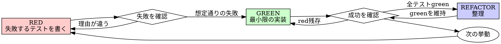

# TDD（テスト駆動開発）

## 概要

**中核原則:** テストが失敗するのを自分の目で見ていないなら、そのテストが正しいものを検証している保証はどこにもない。テストは「書けば機能する」ものではなく、「失敗させて初めて信頼できる」ものである。

このスキルの規則は文言ではなく精神を守るために存在する。文言だけ守って抜け道を探る行為（例: 「テストは先に書いたが、実行して失敗を見てはいない」）は、精神への違反であり、ルール違反そのものと同等に扱う。

## 鉄の掟

```
失敗するテストより先にプロダクションコードを書かない
```

この掟に反してコードを書いてしまったら、そのコードは削除してテストから作り直す。以下はすべて禁止:

- 「参照用に残す」（見ながら書き直すのは、結局テスト後に実装したのと同じ）
- 「一部だけ流用する」
- 「見ながら書く」

削除は削除である。実装はテストからゼロで組み立て直す。

## 適用範囲

**常に適用する:**
- 新機能の実装
- バグ修正
- リファクタリング
- 既存挙動の変更

**例外候補（ユーザーに確認してから）:**
- 使い捨てのプロトタイプ
- 生成されたコード
- 設定ファイル

「今回だけは省略しよう」と思った時点で、それは正当な例外ではなく合理化である。作業を止めて本スキルに戻る。

## RED-GREEN-REFACTOR サイクル



### RED: 失敗するテストを書く

1 つのテストは 1 つの挙動だけを検証する。テスト名は、読んだだけで何を検証しているか分かるものにする。モックは避けられない場合を除いて使わない。

<Good>
```typescript
test("スペースと記号をハイフンに変換してスラッグを生成する", () => {
  expect(generateSlug("Hello, World!")).toBe("hello-world");
});
```
名前が挙動を言い切っている。実コードを対象にした単一の検証。
</Good>

<Bad>
```typescript
test("slug test", () => {
  const spy = vi.spyOn(String.prototype, "toLowerCase");
  generateSlug("Hello, World!");
  expect(spy).toHaveBeenCalled();
});
```
名前が曖昧。しかも検証しているのは内部呼び出しの有無であり、生成結果ではない。
</Bad>

**満たすべき条件:**
- 挙動は 1 つ
- 名前は挙動の説明
- 実コードを対象にする（モックは最終手段）

### RED 検証: 失敗を確認する（必須・スキップ禁止）

テストを実行し、次を確認する。

- 失敗すること（エラーで落ちるのではなく、アサーションが失敗すること）
- 失敗理由が想定通りであること（機能が存在しないために失敗している。typo や設定ミスによる失敗ではない）

**即座に通ったら:** そのテストは既に存在する挙動を検証しているだけである。テストの側を疑い、書き直す。

**エラーで落ちたら:** タイプミスや設定不備を直し、想定通りの理由で失敗するまで再実行する。

### GREEN: テストを通す最小限のコード

<Good>
```typescript
function generateSlug(title: string): string {
  return title
    .toLowerCase()
    .trim()
    .replace(/[^a-z0-9]+/g, "-")
    .replace(/^-+|-+$/g, "");
}
```
テストが要求する分だけを実装している。
</Good>

<Bad>
```typescript
function generateSlug(
  title: string,
  options?: { locale?: string; maxLength?: number; separator?: string }
): string {
  // テストが求めていない引数を先回りで用意している
  // ...
}
```
YAGNI 違反。誰も検証していない仕様を作り込んでいる。
</Bad>

機能追加、他コードのリファクタリング、テストが求めていない「改善」はここでは行わない。

### GREEN 検証: 成功を確認する（必須）

テストを実行し、次を確認する。

- 対象のテストが通ること
- 既存のテストが全部通ったままであること
- 出力にエラーや警告が混ざっていないこと（出力は常にクリーンに保つ）

**対象テストが落ちる:** コードを直す。テストを緩めない。

**既存テストが落ちる:** その場で直す。後回しにしない。

### REFACTOR: 整理する

green を維持したまま行ってよいのは次だけである。

- 重複の除去
- 命名の改善
- ヘルパー関数への抽出

新しい挙動の追加はここでは絶対に行わない。

### 繰り返す

次の挙動に対して RED から再開する。

## 良いテストの条件

| 観点 | 満たす | 満たさない |
|---|---|---|
| **Minimal** | 検証対象は 1 つ。テスト名に「と」が入るなら分割する | `test("メールアドレスとドメインと空白を検証する")` |
| **Clear** | 名前を読めば何を検証しているか分かる | `test("test1")` |
| **Shows intent** | 望ましい API の形を示している | 実装の都合が透けて見え、意図が読めない |

上の RED セクションの Good/Bad 例が、この 3 条件の具体例になっている。

## 順序が重要な理由

テストを後から書いても、書いた瞬間に通ってしまう。通った瞬間に通るテストは何も証明しない。実装のどの分岐も一度も失敗を経由していないので、そのテストが本当にバグを検出できるのかは誰にも分からないままである。

後付けのテストは実装に引きずられる。すでに書いたコードを見ながらテストを書くため、「要求は何か」ではなく「このコードは何をしているか」を検証してしまう。書き忘れたエッジケースは、後からテストを書いても同じように書き忘れる。

手動確認には記録が残らない。何を確認したかはテスターの記憶にしか存在せず、コードが変わるたびに再現できない。一度手で動かして問題がなかったという事実は、そのとき試した経路以外について何も語らない。

「もう X 時間かけたコードを消すのはもったいない」はサンクコスト錯誤である。使った時間は戻らない。今ある選択肢は、削除して TDD でやり直す（確度が高い）か、テストのないコードにテストを後付けする（確度が低い技術的負債を抱える）かの二択でしかない。

## 合理化への反論

| 言い分 | 反論 |
|---|---|
| 単純すぎてテスト不要 | 単純なコードも壊れる。テストは数十秒で書ける。 |
| 後でテストを書く | 後から書いたテストは即座に通る。通っても何も証明しない。 |
| 手動で確認済み | 手動確認は記録が残らず再実行もできない。網羅性の担保にならない。 |
| X 時間分の削除はもったいない | サンクコスト錯誤。テストのないコードを残す方が負債になる。 |
| 参照用に残しておく | 見ながら書き直す時点でテスト後の実装と同じ。削除は削除。 |
| TDD は教条的で、今は実利を優先する | 手戻りとデバッグの時間を考えれば TDD の方が実利的である。 |
| 先に探索的に書いて確かめたい | 探索そのものは構わない。ただし探索コードは使い捨てにし、実装は TDD からやり直す。 |
| テストしにくいのは設計の問題であり、テストの問題ではない | その通り。だからこそ、テストが書きにくいと感じたら設計を疑う合図として使う。 |

## Red Flags

次のいずれかに当てはまったら、その場で作業を止める。理由を検討する必要はない。**コードを削除して TDD でやり直す。**

- テストより先にプロダクションコードを書いた
- テストが実装の後に追加された
- テストが一度も失敗せずに通った
- なぜ失敗したか説明できない
- 「今回だけ」「この場合は違う」と考えている
- 「もう手動で確認したから大丈夫」と考えている
- 「参照用に残して書き直す」と考えている
- 「もう X 時間かけたから消せない」と考えている

## モックとテストユーティリティを追加するとき

モックやテスト専用のユーティリティを追加する前に `references/testing-anti-patterns.md` を読む。モックの挙動を検証してしまう、プロダクションコードにテスト専用メソッドを増やしてしまう、依存関係を理解しないままモックしてしまうといった、TDD のサイクルを回していても踏みがちな落とし穴をまとめている。

## 関連スキル

- 完了を主張する前の検証は `kata:verify-done` に従う。
- バグ修正で再現用の失敗テストを書く手順は `kata:debug` の Phase 4 から本スキルが呼ばれる。
