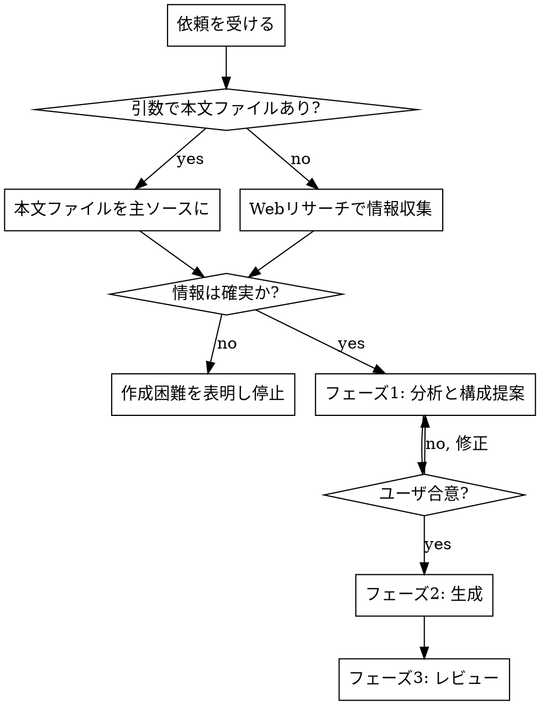

# Book Summary HTML

## Overview

本の要点をまとめた HTML サイトを生成する。**元になる情報は基本的に手元にない前提で、Web 検索・参照（WebSearch / WebFetch）でリサーチして要約を作る。** PDF など本文ファイルを持っている場合のみ、ユーザが引数でそのパスを指定でき、そのときはそれを主ソースにする。出力は **index ページ（書誌情報つき）＋ 章または部ごとの本文ページ** で構成する。

**中核原則：正確さが流暢さに優先する。** 不確かな情報・出典のない事実から要約を作ってはならない。読みやすさのための脚色より、原書および信頼できる出典への忠実さを常に優先する。

## 鉄の掟（最優先）

1. **確実でない情報から本文を作らない。** 本文・書誌情報とも、引数で本文ファイル（PDF 等）が渡されていればそれを主ソースにし、なければ Web 検索でリサーチして信頼できる出典で裏を取る。出典が得られず確証が持てない項目は、推測で埋めず、無理に作らず「作成が難しい」旨をユーザに伝えて止まる。誤った情報でまとめを作らない。
2. **フェーズ1（分析と構成提案）の合意なしに生成へ進まない。** 「作って」と言われても、いきなり生成しない。



## When to use

- 本のタイトル（著者）を指定して、要点まとめの HTML サイトを作りたいとき（情報は Web からリサーチ）
- 手元の PDF など本文ファイルを引数で渡し、それを主ソースに要約サイトを作りたいとき
- 「この本のまとめを HTML で」「要約サイトを作って」といった依頼

## Process

### フェーズ0：前提（ソースと書誌情報の確定）

**まずソースを確定する。** 引数で本文ファイル（PDF 等）が渡されていればそれを主ソースにする。渡されていなければ、本の内容そのものを **WebSearch / WebFetch** でリサーチする（ToolSearch で読み込む）のが基本。どちらの場合も出典の信頼性を確認する。

index には次を**固定書式**で記載する。`templates/index.html` の雛形を使う。

```
タイトル ／ 原題（あれば）
著者：… ／ 訳者：… ／ 出版社：… ／ 発行年：…
```

- 本文ファイルや信頼できる出典に書誌情報があればそれを使う。
- なければ **WebSearch / WebFetch** で取得を試みる。取得元が信頼できるか確認する。
- それでも確定できない項目は、推測で埋めず空欄にし、確定できないなら鉄の掟1に従って停止する。

### フェーズ1：分析と構成提案（生成前・ユーザ合意必須）

`references/analysis-guide.md` の手順で次を行い、**まとめてユーザに提示して合意を得る**。合意できるまで生成しない。

1. **ソースと対象範囲**を確定する（引数の本文ファイルを主ソースにするか、Web リサーチで集めるか。Web の場合は参照した出典を控える）。
2. **ターゲット読者層を本の内容から予想する。** 想定読者を明示する（例：DevOps を初めて学ぶエンジニア／管理職）。要約の語彙・補足量はこの読者に合わせる。
3. **各部・各章の「著者の主張」を抽出する。** 章ごとに「著者が主張している核」を1〜3個の箇条書きにしたリストを作る。これは後の要約で**主張を漏らさないためのチェック基準**になる。
4. 上記を踏まえ **ファイル分割単位（章ごと／部ごと／その他）を提案する。** 長所短所を添え、推奨を先頭に置く。

### フェーズ2：生成

- `assets/style.css` を出力フォルダにコピーし、各 HTML から相対リンクする。
- index は `templates/index.html`、本文ページは `templates/page.html` を雛形にする。
- **index 冒頭の固定文（必須・文言変更禁止）**：`templates/index.html` の `.about-notice`（「このサイトについて」）を `<main>` の先頭に必ず残す。「AIエージェントでリサーチした結果から生成したもので本の内容を網羅していない」「読む前のイメージづけ／読了後の見直しの参考資料として使う」旨を明記した固定文で、書名等に合わせて書き換えない。
- **index の構成（推奨順）**：⓪ このサイトについて（固定文）→ ① 書誌情報 → ② 本書の全体像（著者の主張の骨格・本に基づく）→ ③ この本がターゲットとする読者（本の内容から推定。`.persona-grid`、末尾に「（本書の内容から推定）」と添える）→ ④ おすすめの読み進め方（**AIによる独自分析**。`.ai-analysis` ＋ AIバッジで明示）→ ⑤ 各部/章へのカードナビ。④は本にない情報を書いてよい**唯一の例外**（次項）。
- 各ページは「**要点（見出し）＋簡潔な解説**」を基本単位とし、グラフィカル部品（`references/style-components.md`）で視認性を上げる。
- **カスタム図（SVG 等）の追加は「本にある情報を分かりやすくする」目的に限る。** 本書が図・記法・関係で示している内容を、既存部品で表せないときだけ図にしてよい。本にない事実・関係・分類・主張を図にしてはならない。**乱用しない**（既存部品で足りるなら作らない。点数はページ長ではなく「本書が図・記法・関係で示す構造の数」で決め、1構造につき1点まで・同じ構造を繰り返さない。「この図がなければ本文＋標準部品では伝わらない」と言える図だけ作る）。本書由来でない視覚要素（識別用の配色・配置）は figcaption で明示する。詳細は `references/style-components.md` の「カスタム図解（SVG）」を参照。
- フェーズ1で抽出した**著者の主張を各章に必ず反映**する。
- **文章ルール（`references/writing-rules.md`）を厳守する。** 特に：だ・である調で統一／本にない情報は `補足（本書外）` 部品で明示／比喩・情緒・主張を入れない／つなぎの空文を書かない。
- **例外（AIによる読み進め方の提案）**：index の「おすすめの読み進め方」だけは、AI が本の内容を分析した独自提案を書いてよい。必ず `.ai-analysis` ＋ AIバッジ（「AIによる分析 ― 本書の記述ではなく、内容に基づく独自提案」）で囲み、本書の記述と明確に区別する。誤った内容にならないよう、本の構成・主張と整合する範囲で書く。この例外はこのブロック以外には適用しない。

### フェーズ3：レビュー（専任サブエージェント）

生成後、**独立したレビュアーのサブエージェント**を起動し、`references/review-checklist.md` に照らして検査させる。Agent ツールで「このスキルの review-checklist.md に従い、指定 HTML 群を検査して違反箇所を file:line 付きで列挙せよ」と依頼する。レビュアーは生成器とは別コンテキストで、忖度せず指摘する役割を負う。指摘を本文へ反映し、必要なら再レビューする。

## Quick Reference

| 項目 | 規定 |
|---|---|
| 文体 | だ・である調に統一。用語も統一（表記ゆれ禁止） |
| 本にない情報 | 原則書かない。補う場合は `補足（本書外）` 部品で明示し、誤りでないことを確認 |
| 禁止 | 比喩・情緒・感情・ポエム・著者にない主張／つなぎの空文 |
| index | このサイトについて(固定文) → 書誌情報 → 全体像 → ターゲット読者 → 読み進め方(AI) → 各部カード の順 |
| 冒頭固定文 | `.about-notice`（AI生成・非網羅・読書サポート用途）を index 冒頭に必ず残す。文言変更禁止 |
| AIの読み方提案 | index の「おすすめの読み進め方」のみ可。`.ai-analysis`＋AIバッジで本書外と明示 |
| 分割単位 | 生成前にユーザへ提案・合意 |
| 検証 | 専任レビュアーエージェント＋チェックリスト |

## Common mistakes

- **いきなり生成を始める** → フェーズ1の合意が先。
- **手元に素材がある前提で進める** → 基本は手元に情報がない。引数の本文ファイルがなければ Web リサーチが起点。
- **書誌情報を推測で埋める** → Web 取得を試み、不確実なら停止。
- **読みやすさのために比喩や言い換えを足す** → 本にない比喩・例えは禁止（足すなら `補足（本書外）`）。
- **章ごとに文体が揺れる** → だ・である調で全章統一。
- **内容のないつなぎ文で量を稼ぐ** → 理解を阻害する。削る。
- **分かりやすさのために図を足しすぎる** → カスタム図は本書が図・記法・関係で示す構造に限り、1構造につき1点。ページが長くても水増ししない。既存部品で足りるなら作らない。本にない関係・分類を図にしない。
- **レビューを省く** → 自己生成物は癖が残る。必ず別エージェントで検査。

## Files

- `references/writing-rules.md` — 文章ルールの詳細（必読）
- `references/analysis-guide.md` — ターゲット読者の予想・著者の主張の抽出手順
- `references/review-checklist.md` — フェーズ3レビュアー用チェック項目
- `references/style-components.md` — グラフィカル部品の一覧と使いどころ
- `assets/style.css` — 共通スタイル（出力にコピーして使う）
- `templates/index.html` — 書誌情報つき index 雛形
- `templates/page.html` — 章/部ページ雛形
