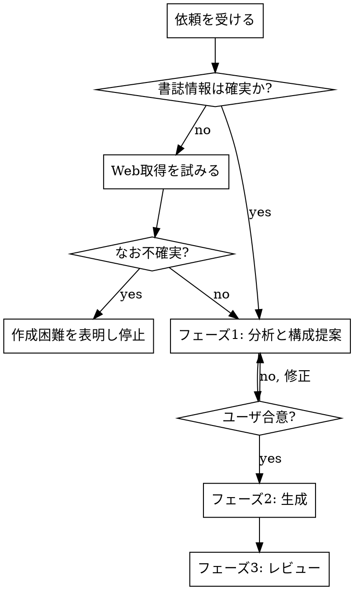

# Book Summary HTML

## Overview

本の読書メモ素材（mindmap・memo・本文）から、要点をまとめた HTML サイトを生成する。出力は **index ページ（書誌情報つき）＋ 章または部ごとの本文ページ** で構成する。

**中核原則：正確さが流暢さに優先する。** 不確かな情報・本にない事実から要約を作ってはならない。読みやすさのための脚色より、原書への忠実さを常に優先する。

## 鉄の掟（最優先）

1. **確実でない情報から本文を作らない。** 書誌情報（後述の固定書式）が手元になければ、まず Web 検索で取得を試みる。なお不足・不確実なら、無理に作らず「作成が難しい」旨をユーザに伝えて止まる。誤った情報でまとめを作らない。
2. **フェーズ1（分析と構成提案）の合意なしに生成へ進まない。** 「作って」と言われても、いきなり生成しない。



## When to use

- 本の章別 mindmap や memo から、要点まとめの HTML を作りたいとき
- 既存の読書メモを、章/部ごとに整理して読み物化したいとき
- 「要約サイトを作って」「この本のまとめを HTML で」といった依頼

## Process

### フェーズ0：前提（書誌情報の確定）

index には次を**固定書式**で記載する。`templates/index.html` の雛形を使う。

```
タイトル ／ 原題（あれば）
著者：… ／ 訳者：… ／ 出版社：… ／ 発行年：…
```

- 素材や本に書誌情報があればそれを使う。
- なければ **WebSearch / WebFetch** で取得を試みる（ToolSearch で読み込む）。取得元が信頼できるか確認する。
- それでも確定できない項目は、推測で埋めず空欄にし、確定できないなら鉄の掟1に従って停止する。

### フェーズ1：分析と構成提案（生成前・ユーザ合意必須）

`references/analysis-guide.md` の手順で次を行い、**まとめてユーザに提示して合意を得る**。合意できるまで生成しない。

1. **素材の場所と範囲**を確認する（mindmap/memo/本文のどれを主ソースにするか）。
2. **ターゲット読者層を本の内容から予想する。** 想定読者を明示する（例：DevOps を初めて学ぶエンジニア／管理職）。要約の語彙・補足量はこの読者に合わせる。
3. **各部・各章の「著者の主張」を抽出する。** 章ごとに「著者が主張している核」を1〜3個の箇条書きにしたリストを作る。これは後の要約で**主張を漏らさないためのチェック基準**になる。
4. 上記を踏まえ **ファイル分割単位（章ごと／部ごと／その他）を提案する。** 長所短所を添え、推奨を先頭に置く。

### フェーズ2：生成

- `assets/style.css` を出力フォルダにコピーし、各 HTML から相対リンクする。
- index は `templates/index.html`、本文ページは `templates/page.html` を雛形にする。
- **index の構成（推奨順）**：① 書誌情報 → ② 本書の全体像（著者の主張の骨格・本に基づく）→ ③ この本がターゲットとする読者（本の内容から推定。`.persona-grid`、末尾に「（本書の内容から推定）」と添える）→ ④ おすすめの読み進め方（**AIによる独自分析**。`.ai-analysis` ＋ AIバッジで明示）→ ⑤ 各部/章へのカードナビ。④は本にない情報を書いてよい**唯一の例外**（次項）。
- 各ページは「**要点（見出し）＋簡潔な解説**」を基本単位とし、グラフィカル部品（`references/style-components.md`）で視認性を上げる。
- フェーズ1で抽出した**著者の主張を各章に必ず反映**する。
- **文章ルール（`references/writing-rules.md`）を厳守する。** 特に：だ・である調で統一／本にない情報は `補足（本書外）` 部品で明示／比喩・情緒・主張を入れない／つなぎの空文を書かない。
- **例外（AIによる読み進め方の提案）**：index の「おすすめの読み進め方」だけは、AI が本の内容を分析した独自提案を書いてよい。必ず `.ai-analysis` ＋ AIバッジ（「AIによる分析 ― 本書の記述ではなく、内容に基づく独自提案」）で囲み、本書の記述と明確に区別する。誤った内容にならないよう、本の構成・主張と整合する範囲で書く。この例外はこのブロック以外には適用しない。

### フェーズ3：レビュー（専任サブエージェント）

生成後、**独立したレビュアーのサブエージェント**を起動し、`references/review-checklist.md` に照らして検査させる。Agent ツールで「このスキルの review-checklist.md に従い、指定 HTML 群を検査して違反箇所を file:line 付きで列挙せよ」と依頼する。レビュアーは生成器とは別コンテキストで、忖度せず指摘する役割を負う。指摘を本文へ反映し、必要なら再レビューする。

## Quick Reference

| 項目 | 規定 |
|---|---|
| 文体 | だ・である調に統一。用語も統一（表記ゆれ禁止） |
| 本にない情報 | 原則書かない。補う場合は `補足（本書外）` 部品で明示し、誤りでないことを確認 |
| 禁止 | 比喩・情緒・感情・ポエム・著者にない主張／つなぎの空文 |
| index | 書誌情報 → 全体像 → ターゲット読者 → 読み進め方(AI) → 各部カード の順 |
| AIの読み方提案 | index の「おすすめの読み進め方」のみ可。`.ai-analysis`＋AIバッジで本書外と明示 |
| 分割単位 | 生成前にユーザへ提案・合意 |
| 検証 | 専任レビュアーエージェント＋チェックリスト |

## Common mistakes

- **いきなり生成を始める** → フェーズ1の合意が先。
- **書誌情報を推測で埋める** → Web 取得を試み、不確実なら停止。
- **読みやすさのために比喩や言い換えを足す** → 本にない比喩・例えは禁止（足すなら `補足（本書外）`）。
- **章ごとに文体が揺れる** → だ・である調で全章統一。
- **内容のないつなぎ文で量を稼ぐ** → 理解を阻害する。削る。
- **レビューを省く** → 自己生成物は癖が残る。必ず別エージェントで検査。

## Files

- `references/writing-rules.md` — 文章ルールの詳細（必読）
- `references/analysis-guide.md` — ターゲット読者の予想・著者の主張の抽出手順
- `references/review-checklist.md` — フェーズ3レビュアー用チェック項目
- `references/style-components.md` — グラフィカル部品の一覧と使いどころ
- `assets/style.css` — 共通スタイル（出力にコピーして使う）
- `templates/index.html` — 書誌情報つき index 雛形
- `templates/page.html` — 章/部ページ雛形
